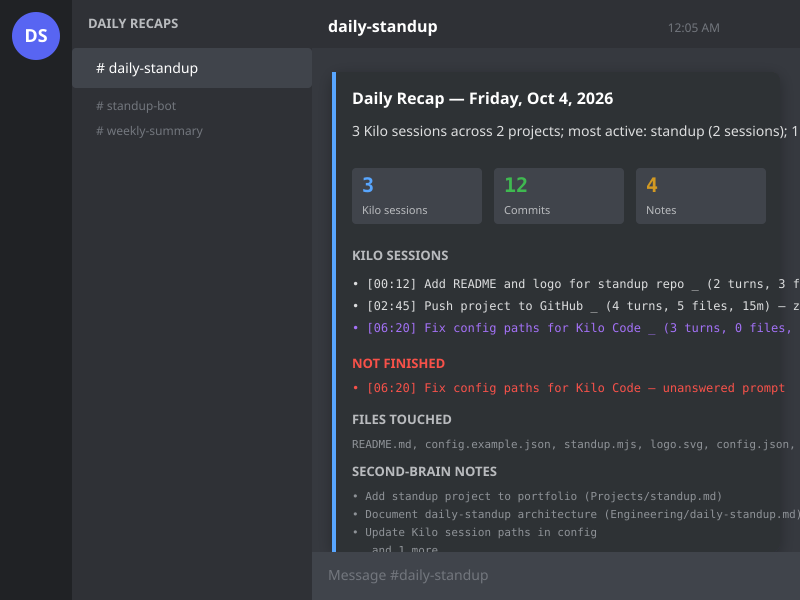

# Daily Standup

Automated daily recap of your coding activity, posted to Discord. Collects work from Kilo/Claude sessions, GitHub commits, second-brain notes, and new projects — then sends a clean summary to a Discord webhook.

## What it captures

| Source | What it shows |
|--------|---------------|
| **Kilo/Claude sessions** | Session topics, turns, files edited, duration, unfinished work |
| **GitHub commits** | Repos pushed, commit messages, new repos created |
| **Second-brain notes** | Markdown notes added/updated in your knowledge repo |
| **Projects share** | New project folders created, existing projects touched |

## Example output



The Discord embed includes:
- Narrative summary (rule-based or LLM-generated)
- Stats fields
- Per-project session list with timestamps
- Pending work classification (unanswered, discussed-only, deferred)
- Files touched, brain notes, GitHub commits

## Quick start

```bash
# 1. Clone
git clone https://github.com/brgjr10/daily-standup.git
cd daily-standup

# 2. Configure
cp config.example.json config.json
# Edit config.json — at minimum, add your Discord webhook URL

# 3. (Optional) Environment overrides
cp .env.example .env
# Edit .env if you prefer env vars over config.json

# 4. Test run
node standup.mjs --dry-run
```

## Configuration

### `config.json` (required)

```json
{
  "discordWebhookUrls": ["https://discord.com/api/webhooks/..."],
  "githubUsername": "your-github-username",
  "githubToken": null,
  "githubTokenSource": "path/to/brain-mcp/config.json",
  "sessionRoots": [
    { "path": "C:\\Users\\you\\.claude", "label": "windows" },
    { "path": "\\\\SERVER\\.claude", "label": "server" }
  ],
  "projectsRoot": "\\\\SERVER\\AppData\\Projects",
  "secondBrainRepo": "yourusername/second_brain",
  "earlyMorningCutoffHour": 6,
  "summarize": {
    "enabled": false,
    "apiUrl": "",
    "apiKeyEnv": "",
    "model": ""
  }
}
```

| Field | Required | Description |
|-------|----------|-------------|
| `discordWebhookUrls` | **Yes** | One or more Discord webhook URLs |
| `githubUsername` | **Yes** | Your GitHub username (for commit attribution) |
| `githubToken` | No | PAT with `repo` scope; if omitted, reads from `githubTokenSource` |
| `githubTokenSource` | No | Path to a JSON file containing `{ "token": "..." }` (reuses brain-mcp token) |
| `sessionRoots` | **Yes** | Array of `{ path, label }` pointing to Kilo/Claude session directories |
| `projectsRoot` | No | Root folder scanned for new/touched project directories |
| `secondBrainRepo` | No | `owner/repo` of your notes repo (GitHub) |
| `earlyMorningCutoffHour` | No | Hour (0-23) before which "yesterday" is the target day (default: 6) |
| `summarize` | No | Optional LLM narrative config (see below) |

### `.env` (optional, overrides config)

```bash
# Webhook (comma-separated for multiple)
STANDUP_WEBHOOK=https://discord.com/api/webhooks/...

# GitHub token (if not in config)
GITHUB_TOKEN=ghp_...

# LLM narrative (optional)
STANDUP_LLM_API_URL=http://localhost:11434/v1/chat/completions
STANDUP_LLM_API_KEY=sk-...
STANDUP_LLM_MODEL=llama3
```

Real environment variables always win over `.env`, which wins over `config.json`.

## Scheduling

### Windows Task Scheduler (via included script)

```powershell
# Run as Administrator
.\install-task.ps1
```

Creates a daily task at 00:05 (captures the previous day).

### Manual / cron / systemd

```bash
# Run for today (after 06:00) or yesterday (before 06:00)
node standup.mjs

# Explicit date
node standup.mjs --date 2026-10-01

# Dry run (prints to console, sends nothing)
node standup.mjs --dry-run

# Force send even if already sent for that date
node standup.mjs --force
```

## LLM Narrative (optional)

Enable a prose summary instead of the rule-based one:

1. Point `STANDUP_LLM_API_URL` at any OpenAI-compatible `/chat/completions` endpoint
2. Set `STANDUP_LLM_API_KEY` if the endpoint requires auth
3. Set `STANDUP_LLM_MODEL` (e.g., `llama3`, `gpt-4o-mini`)

Works with local ModelRouter, Ollama, LM Studio, or any OpenAI-compatible proxy.

## How it works

1. **Idempotency** — A `state/sent.json` tracks which dates have been sent. Re-runs for the same day exit silently (use `--force` to override).
2. **Date resolution** — Runs before `earlyMorningCutoffHour` target "yesterday"; after, target "today". The scheduled 00:05 run captures the previous day.
3. **Kilo sessions** — Scans both legacy `.jsonl` files and the modern SQLite DB (`~/.local/share/kilo/kilo.db`) for the target day.
4. **GitHub** — Uses a PAT (or public events fallback) to list your repos pushed that day, then fetches commits authored by you.
5. **Second brain** — Reads commits on the configured notes repo, extracts `.md` file changes.
6. **Projects share** — Checks `birthtime`/`mtime` on directories under `projectsRoot` for new/touched projects.
7. **Discord** — Sends embeds (max 10 per message, splits across messages if needed). Handles rate limits with retry.

## Project structure

```
standup/
├── standup.mjs              # Main script
├── lib/
│   └── query-kilo-sessions.py  # Python helper for Kilo SQLite DB
├── config.example.json      # Template config
├── .env.example             # Template env file
├── install-task.ps1         # Windows Task Scheduler installer
├── run-now.ps1              # Convenience wrapper for manual runs
├── .gitignore
└── state/                   # Created at runtime (ignored)
    ├── sent.json            # Sent-date tracking
    └── last-run.json        # Last execution metadata
```

## Requirements

- **Node.js** 18+ (for `fetch`, `import.meta.url`)
- **Python** 3.8+ (for Kilo DB query helper)
- **Discord webhook** (create in Server Settings → Integrations → Webhooks)
- **GitHub PAT** (optional but recommended for private repos; `repo` scope)

## License

MIT — use freely.